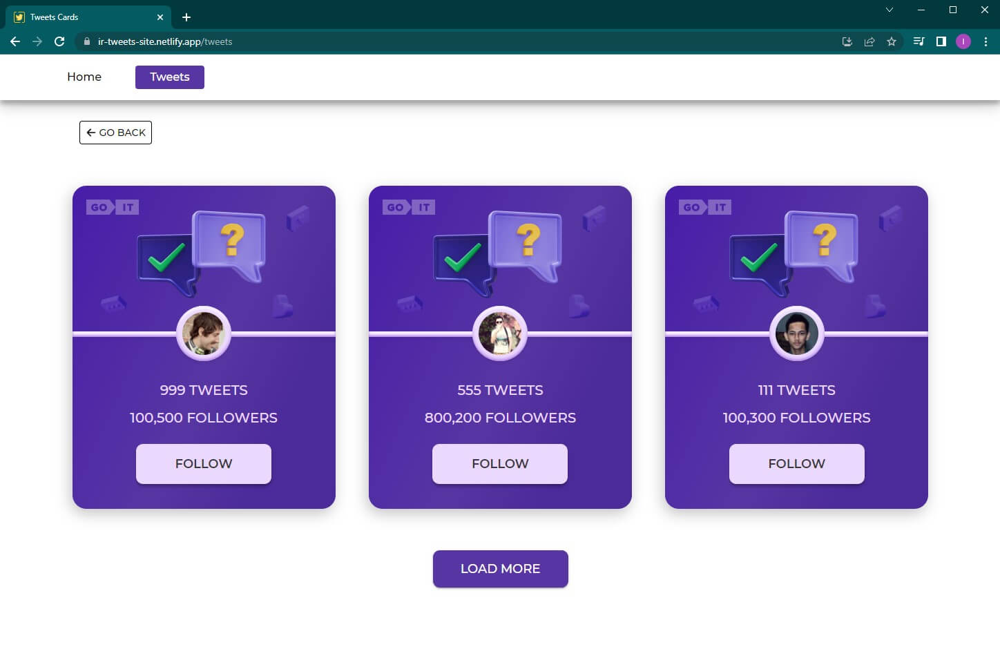

# Tweets Cards

## It's simple app whith tweet cards and interactive buttons on it.

## <ul>Main functionality:</ul>
<li>When you click on the Follow button, the text changes to Following. Also
the color of the button changes. And yours is added to the number of followers.</li>
<li>When the page is updated, the final result of the user's actions is recorded.</li>
<li>When you click the button again, its text and color change to the original
state. The number of followers also changes.</li>

## Used technologies:

HTML/CSS, React, React-router-dom, Axios, Styled Components.

The stylization implements a responsive layout with three breakpoints: 400px,
768px, 1440px.

## Back-end

The backend was implemented using [Mockapi](https://mockapi.io/). Was created a
user collection of 15 objects.
